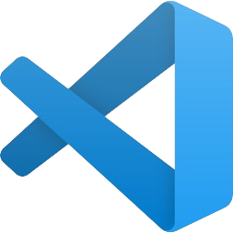

<div align="center">
  <h1> Clone Frontend</h1>
</div>

---

<h1>📍 목차</h1>

1. [프로젝트 소개](#1-프로젝트-소개)  
2. [팀원 소개 및 역할](#2-팀원-소개-및-역할)  
3. [주요 기능](#3-주요-기능)  
4. [프로젝트 구조 및 흐름](#4-프로젝트-구조-및-흐름)  
5. [사용 기술 및 도구](#5-사용-기술-및-도구)  
6. [브랜치 전략 및 커밋 컨벤션](#6-브랜치-전략-및-커밋-컨벤션)  
7. [최종 회고](#7-최종-회고)

---

## 1. 프로젝트 소개

#### [오르미 11기 백엔드 양성과정 - 프론트엔드 실전 협업 프로젝트]

> 영상 추천 YouTube 클론 페이지 구현 (실제 유튜브의 핵심 기능과 UI/UX를 최대한 유사하게 구현)

- 📅 진행 기간: 2025년 4월 21일 ~ 2025년 5월 12일
- 🎯 주요 목표:
  - Home / Channel / Video / Search / Subscribe / Like 기능 완전 구현
  - HTML/CSS/JS 기반 프론트엔드 구조 설계 및 컴포넌트 재사용
  - Express 기반 서버와 API 연동 포함한 실전 협업 경험 축적

---

## 2. 팀원 소개 및 역할
<table>
  <tr>
    <td align="center" width="150px">
      <a href="https://github.com/KIMYOUNGLONG" target="_blank">
        </a>
    </td>
    <td align="center" width="150px">
      <a href="https://github.com/sungyeonkim27" target="_blank">
        </a>
    </td>
    <td align="center" width="150px">
      <a href="https://github.com/yoonhyunjin02" target="_blank">
        </a>
    </td>
    <td align="center" width="150px">
      <a href="https://github.com/jwljwljwl" target="_blank">
        </a>
    </td>
  </tr>
  <tr>
    <td align="center">
      <a href="https://github.com/KIMYOUNGLONG" target="_blank">김영롱</a>
    </td>
    <td align="center">
      <a href="https://github.com/sungyeonkim27" target="_blank">김성연</a>
    </td>
    <td align="center">
      <a href="https://github.com/yoonhyunjin02" target="_blank">윤현진</a>
    </td>
    <td align="center">
      <a href="https://github.com/jwljwljwl" target="_blank">이재원</a>
    </td>
</table>

### 📆 기간별 작업 요약

| 날짜        | 작업 내용 요약                                                                 |
|-------------|----------------------------------------------------------------------------------|
| 4/21 (Day 1) | GitHub 초기 세팅, Notion 공유 환경 구축, 브랜치 전략 논의                    |
| 4/22 (Day 2) | 상단바/네비바 HTML·CSS 설계, feature/header 병합, 기본 템플릿 구조 확립      |
| 4/23 (Day 3) | 필터바 기능 구축, 영상 카드 레이아웃 정렬, 버튼 UI 분리, 브랜치 작업 분담 시작 |
| 4/24 (Day 4) | 채널 페이지 UI 설계 시작, 썸네일/프로필/구독 정보 블럭 레이아웃 구성         |
| 4/25 (Day 5) | video.ejs 구성, 추천영상 카드 리스트 수평정렬 및 레이아웃 안정화              |
| 4/26~27      | videoCard 템플릿 분기 재사용 적용, hover 시 영상 미리보기 기능 구현           |
| 4/28 (Day 6) | 검색 기능 확장 (태그/채널명 기반), 좋아요/싫어요/공유/저장 인터랙션 구현     |
| 4/29         | JS 모듈화(button.js 등), 대댓글 기초 구조 작성, 검색 모듈 리팩토링            |
| 4/30~5/2     | 정렬 기능 구현, 반응형 보완, 추천영상 카드 디버깅, 댓글 컴포넌트 정리         |
| 5/3~5/5      | 플레이리스트 기능 구현, 홈/채널/비디오 전체 흐름 통합, 스타일링 마무리        |
| 5/6~         | 테마(다크/라이트) 토글 기획 및 구조 분리, 검색 결과 페이지 스타일 개선 중     |

### 🧩 팀원별 구현 내역

| 이름     | 주요 구현 내용                                                                                              |
|----------|-------------------------------------------------------------------------------------------------------------|
| **윤현진** | 🔧 전체 구조 설계, API 연동 총괄, 템플릿 모듈화<br>– 필터바/hover 썸네일 구현, 공통 템플릿 재사용 설계<br>– develop 통합 관리 및 충돌 해결 |
| **김성연** | 🔍 검색 기능 전체 설계<br>– 홈/채널/비디오 각 페이지별 검색 구현, 필터바 클릭 이벤트 연동<br>– 반응형 대응, 조회수 단위 포맷팅, 테마 기능 구조 조사 |
| **이재원** | 🎮 사용자 인터랙션 중심<br>– 구독/좋아요/싫어요 동작 구현, 공유/저장 기능<br>– 댓글 정렬, 대댓글 기능, sidebar 토글 및 js 모듈화(button.js 등) |
| **김영롱** | 📚 문서화 및 스타일 보조<br>– README 전체 구성 및 흐름 정리<br>– videoCard-video 레이아웃 구성, 추천영상 정렬 구조 및 스타일링 보완       |

---

## 3. 주요 기능

### ✅ 홈(Home)
- 최신 영상 카드 출력 / 검색창 기능 / 필터 카테고리 클릭 이동
- 마우스 hover 시 썸네일 **미리보기 동영상 재생** 기능 구현

### ✅ 채널(Channel)
- 채널 프로필/배너 출력 / 채널별 영상 리스트 동적 렌더링
- 구독 기능, show more 구독자 목록 확장 / 동적 정렬 구현

### ✅ 비디오(Video)
- 영상 재생 및 상세 정보 표시 / 댓글 작성/삭제
- 좋아요/싫어요 토글 기능 / 공유/저장 버튼 / 정렬 모달 구현

### ✅ 공통 기능
- 반응형 UI (미디어쿼리 기반 일부 페이지 적용)
- 상단바/네비바 ejs 템플릿 **재사용 및 모듈화** 구조 적용
- 사이드바 토글 기능 / JS 기능 분리 및 모듈화
- SVG 버튼 상태 변화 및 아이콘 동적 처리 구현
- **videoCard 템플릿 분기 사용으로 모든 페이지에서 공통 카드 컴포넌트 재사용**

---

## 4. 프로젝트 구조 및 흐름

### 📂 디렉토리 구조

```
youtube-clone-frontend/
├── public/
│   └── assets/ (icons, video)
├── views/
│   └── partials/ (header, nav, videoCard 등)
│   └── home.ejs, video.ejs, channel.ejs
├── css/ (home.css, video.css, channel.css 등)
├── js/  (button.js, thumbnail-play.js, search 관련 js 등)
├── server.js
└── README.md
```

### 📅 기간별 주요 흐름 요약

| 날짜 범위        | 주요 진행 사항                                                                                     |
|------------------|----------------------------------------------------------------------------------------------------|
| 4/21 ~ 4/22      | 프로젝트 초기 세팅, 팀 구성, 브랜치 전략 수립, 상단바 및 네비바 기본 구성                         |
| 4/23 ~ 4/24      | 홈 카드 UI / 검색 기능 / 버튼 UI 구성 / 필터바 기능 / 기능별 브랜치 작업 분담                     |
| 4/25 ~ 4/26      | 비디오 페이지 구성, 공유/저장/정렬 기능 구현 / 영상 hover 미리보기 / 반응형 미디어쿼리 적용       |
| 4/27 ~           | API 연동 고도화 / 썸네일-프로필 링크 연결 / 정렬 모달, 채널 구독 기능 등 완성도 향상 작업         |

---

## 5. 사용 기술 및 도구

---

### 🔹 협업


---

### 🔹 개발 도구

<span style="display: inline-block; background-color:rgb(35, 83, 114); color: white; padding: 6px 12px; font-weight: bold; font-size: 12px; border-radius: 4px;">
  
  VS Code
</span>

---

### 🔹 커뮤니케이션


---

### 🔹 개발 언어


---

## 6. 브랜치 전략 및 커밋 컨벤션

### 🔹 브랜치 전략

| 브랜치명       | 용도 설명                                       |
|----------------|--------------------------------------------------|
| `main`         | 최종 배포 브랜치                                 |
| `develop`      | 기능 통합 및 협업용 브랜치                       |
| `feature/*`    | 기능별 개발 브랜치 (예: feature/video, feature/search 등) |

### 🔸 커밋 컨벤션

| Prefix      | 의미                             |
|-------------|----------------------------------|
| `feat`      | 새로운 기능 추가                 |
| `fix`       | 버그 수정                        |
| `docs`      | 문서 작성 또는 수정              |
| `style`     | 코드 포맷팅 (기능 변화 없음)     |
| `refactor`  | 코드 구조 개선                   |
| `chore`     | 기타 작업 (빌드, 설정 등)        |

---

## 7. 최종 회고

> “초보탈출 넘버원” 팀은 단순한 클론이 아니라 실전 개발 프로세스를 전부 경험했습니다.

- 팀원 모두가 실제 유튜브 기능과 UI를 기준 삼아 **기능 우선 중심의 협업**을 진행했고,
- 각자의 역할을 정확히 분배하며 **브랜치 전략, API 연동, 컴포넌트 재사용, 반응형 UI**를 적극 구현했습니다.
- Git 충돌 해결, js 모듈화, 시멘틱 마크업 등 실무에 준하는 과정을 겪으며 **개발자로 성장하는 기반**을 만들었습니다.

> 기능을 구현하는 것에서 끝나지 않고, **협업, 책임감, 소통, 그리고 도전정신**을 함께 체득한 의미 있는 프로젝트였습니다.

---

<div align="center">
  <strong>✨ Team 초보탈출 넘버원 - YouTube Clone 프로젝트 완료! ✨</strong>
</div>
