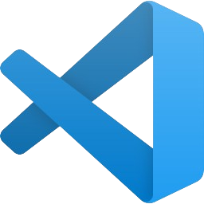

  <h1> clone frontend</h1>

<h1>📍 목차</h1>

  1. [프로젝트 소개](#1)
  2. [팀원 소개 및 역할](#2)
  3. [주요 기능](#3)
  4. [프로젝트 구조](#4)
  5. [사용 기술 및 도구](#5)
  6. [컨벤션](#6)

# 프로젝트  소개

#### [ 오르미 11기 백엔드 양성 과정 ]

> 첫 번째 프론트엔트 프로젝트 - 영상 추천 Youtube 클론 페이지

- 기간 : 2025년 4월 21일 ~ 2025년 5월 12일

# 팀원 소개 및 역할
<table>
  <tr>
    <td align="center" width="150px">
      
    </td>
    <td align="center" width="150px">
      
    </td>
    <td align="center" width="150px">
      
    </td>
    <td align="center" width="150px">
      
    </td>
  </tr>
  <tr>
    <td align="center">
      <a href="https://github.com/KIMYOUNGLONG" target="_blank">김영롱</a>
    </td>
    <td align="center">
      <a href="https://github.com/sungyeonkim27" target="_blank">김성연</a>
    </td>
    <td align="center">
      <a href="https://github.com/yoonhyunjin02" target="_blank">윤현진</a>
    </td>
    <td align="center">
      <a href="https://github.com/jwljwljwl" target="_blank">이재원</a>
    </td>
</table>

<!-- 역할분담 추가 -->

# 주요 기능
- 홈 화면
- 재생 화면
- 비디오 화면

<!-- 각 화면 소개 추가 예정 -->
<!-- AI API 뭐 썼는지 -->

# 프로젝트 구조
> 디렉토리 구조 설명
> 브렌치 전략
> 커밋

# 사용 기술 및 도구
개발 도구

- 협업

- 개발 도구

  
  VS Code

- 커뮤티케이션

 
- 개발 언어

   

# 컨벤션
- 브랜치 전략
- 커밋 컨벤션