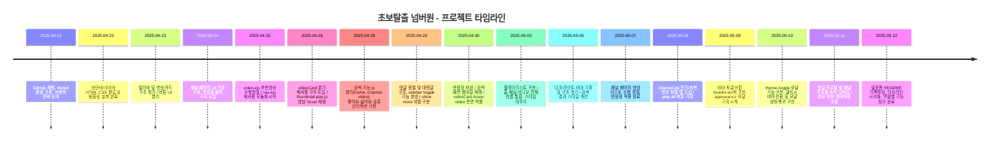
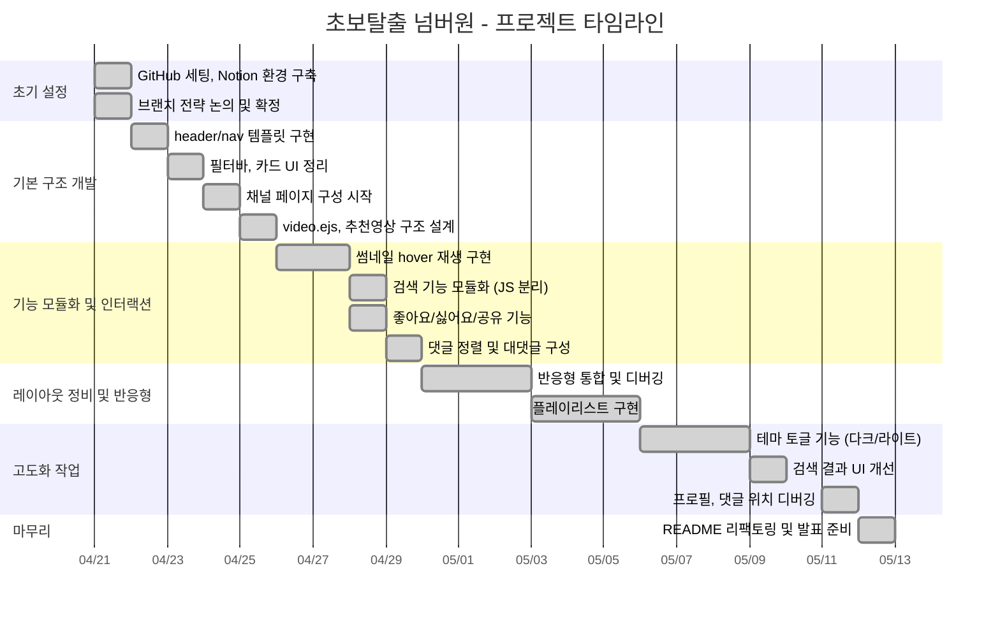

<div align="center">
  <h1> Clone Frontend</h1>
</div>

---

<details>
  <summary><h1>📍 목차</h1></summary>

1. [프로젝트 소개](#1-프로젝트-소개)  
2. [팀원 소개 및 역할](#2-팀원-소개-및-역할)  
3. [주요 기능](#3-주요-기능)  
4. [프로젝트 구조](#4-프로젝트-구조)  
5. [사용 기술 및 도구](#5-사용-기술-및-도구)  
6. [브랜치 전략 및 커밋 컨벤션](#6-브랜치-전략-및-커밋-컨벤션)  
7. [최종 회고](#7-최종-회고)
    
  </details>

---

## 1. 프로젝트 소개
<details>
<summary>자세히 보기</summary>

#### [오르미 11기 백엔드 양성과정 - 프론트엔드 실전 협업 프로젝트]

> 영상 추천 YouTube 클론 페이지 구현 (실제 유튜브의 핵심 기능과 UI/UX를 최대한 유사하게 구현)

- 📅 진행 기간: 2025년 4월 21일 ~ 2025년 5월 12일
- 🎯 주요 목표:
  - Home / Channel / Video / Search / Subscribe / Like 기능 완전 구현
  - HTML/CSS/JS 기반 프론트엔드 구조 설계 및 컴포넌트 재사용
  - Express 기반 서버와 API 연동 포함한 실전 협업 경험 축적
    
  </details>

---

## 2. 팀원 소개 및 역할
<details>
<summary>자세히 보기</summary>
<table>
  <tr>
    <td align="center" width="150px">
      <a href="https://github.com/KIMYOUNGLONG" target="_blank">
        </a>
    </td>
    <td align="center" width="150px">
      <a href="https://github.com/sungyeonkim27" target="_blank">
        </a>
    </td>
    <td align="center" width="150px">
      <a href="https://github.com/yoonhyunjin02" target="_blank">
        </a>
    </td>
    <td align="center" width="150px">
      <a href="https://github.com/jwljwljwl" target="_blank">
        </a>
    </td>
  </tr>
  <tr>
    <td align="center">
      <a href="https://github.com/KIMYOUNGLONG" target="_blank">김영롱</a>
    </td>
    <td align="center">
      <a href="https://github.com/sungyeonkim27" target="_blank">김성연</a>
    </td>
    <td align="center">
      <a href="https://github.com/yoonhyunjin02" target="_blank">윤현진</a>
    </td>
    <td align="center">
      <a href="https://github.com/jwljwljwl" target="_blank">이재원</a>
    </td>
</table>

### 📆 기간별 작업 요약

| 날짜         | 작업 내용 요약                                                                 |
|--------------|----------------------------------------------------------------------------------|
| 4/21         | GitHub 저장소 초기 세팅, Notion 협업 환경 구축, 브랜치 전략 확립               |
| 4/22         | 상단바·네비바 HTML/CSS 설계 및 템플릿 분리 구조 시작 (`header.ejs`, `nav.ejs`) |
| 4/23         | 필터바 기능 구현, 영상 카드 UI 구조 정리, 버튼 인터페이스 분리 및 역할 분담 시작 |
| 4/24         | 채널 페이지 UI 레이아웃 구성, 썸네일·프로필·구독 정보 블럭 구현 시작           |
| 4/25         | `video.ejs` 기본 구성, 추천 영상 리스트 수평 정렬, `nav.ejs` 템플릿 재사용 적용 |
| 4/26~27      | `videoCard.ejs` 분기별 재사용 구조 도입, 썸네일 hover 시 영상 미리보기 기능 구현 |
| 4/28         | 검색 기능 모듈화 (`home`, `channel`, `video`), 좋아요/싫어요/공유 기능 완성     |
| 4/29         | 댓글 정렬 및 대댓글 구조 구현, 사이드바 토글 기능, `show more` 버튼 인터랙션 처리 |
| 4/30~5/2     | 정렬 기능 개선, 추천 영상 카드 디버깅, 반응형 레이아웃 통일, 댓글 컴포넌트 정리 |
| 5/3~5/5      | 플레이리스트 기능 구현, 전체 페이지 흐름 통합, 시각적 스타일 마무리             |
| 5/6~5/10     | 테마 토글(다크/라이트) 기능 및 모달 구현, 검색 결과 페이지 레이아웃 개선       |
| 5/11         | 레이아웃 통일성 검토, 반응형 UI 미세 조정, 주요 기능 마무리 및 버그 수정         |
| 5/12         | 유튜브 코드 최종 점검 및 정리, 버그 수정 및 레이아웃 통일 마무리<br>README 리팩토링 및 발표 자료 정리, 프로젝트 마감 🎉 |

<h3>🧩 팀원별 구현 내역</h3>

<table>
  <thead>
    <tr>
      <th style="min-width: 120px; max-width: 120px;">이름</th>
      <th>주요 구현 내용</th>
    </tr>
  </thead>
  <tbody>
    <tr>
      <td style="min-width: 120px; max-width: 120px;"><strong>윤현진</strong></td>
      <td>
        🔧 프로젝트 설계 및 기술 구조 전반 총괄<br>
        – <code>partials/</code> 내 공통 템플릿 구조 설계 (<code>header.ejs</code>, <code>nav.ejs</code>, <code>videoCard.ejs</code>)<br>
        – <code>videoCard.ejs</code> 템플릿을 홈/채널/비디오에서 분기 재사용 가능하게 구현<br>
        – 썸네일 hover 시 영상 미리보기 동작 (<code>thumbnail-play.js</code>)<br>
        – 플레이리스트/추천영상/댓글 흐름 전체 구현<br>
        – 페이지 간 상태 유지 포함한 테마(다크/라이트) 토글 구현<br>
        – API 연동 흐름 구성 (<code>post.js</code>, <code>comment.js</code>, <code>search.js</code> 등)<br>
        – 브랜치 전략 및 Git 협업 구조 주도 (<code>develop</code> 운영, 충돌 해결 포함)
      </td>
    </tr>
    <tr>
      <td style="min-width: 120px; max-width: 120px;"><strong>김성연</strong></td>
      <td>
        🔍 검색 기능 전체 설계 및 반응형 전담<br>
        – 홈/채널/비디오 페이지별 검색 모듈 구현 (<code>*_search.js</code> 분리)<br>
        – 필터바 클릭 → 태그 기반 필터 검색 구현<br>
        – 조회수 포맷 변환 (예: 1234 → 1.2K)<br>
        – 비디오 페이지 반응형 구조 설계 및 CSS 디버깅<br>
        – 테마 토글 기능 구조 이해 및 다크/라이트 디자인 테마 분리<br>
        – 레이아웃 테두리 색, 카드 간 padding 등 UI 세부 시각 조정
      </td>
    </tr>
    <tr>
      <td style="min-width: 120px; max-width: 120px;"><strong>이재원</strong></td>
      <td>
        🎮 UI 인터랙션 및 댓글 시스템 구현<br>
        – 좋아요/싫어요/구독 기능 + SVG 상태 전환 구현<br>
        – 공유/저장 기능 모달 UI + 기능 처리 (<code>button.js</code>)<br>
        – 댓글 정렬 및 대댓글 구조 구현 (들여쓰기 포함 UI 완성)<br>
        – <code>video.ejs</code> 추천 영상 카드 정렬, 반응형 맞춤 CSS<br>
        – sidebar toggle 기능 구현 및 channel/video 화면 적용
      </td>
    </tr>
    <tr>
      <td style="min-width: 120px; max-width: 120px;"><strong>김영롱</strong></td>
      <td>
        📚 문서화 및 CSS 구조 보조<br>
        – <code>README.md</code> 전체 구성, 목차 및 흐름 설계<br>
        – 기술 스택 시각화 및 shields 뱃지 마크업 정리<br>
        – 목차 토글 기능 적용 (<code>&lt;details&gt;</code> + <code>&lt;summary&gt;</code>)<br>
        – 초반 margin/padding 구조 조정 (<code>channel.css</code>, <code>video.css</code>)<br>
      </td>
    </tr>
  </tbody>
</table>

<h3>📌 프로젝트 타임라인 시각화</h3>

<p align="center">
  
</p>






</details>

---

## 3. 주요 기능
<details>
<summary>자세히 보기</summary>

### ✅ 홈(Home)
- 최신 영상 카드 출력 / 검색창 기능 / 필터 카테고리 클릭 이동
- 마우스 hover 시 썸네일 **미리보기 동영상 재생** 기능 구현

### ✅ 채널(Channel)
- 채널 프로필/배너 출력 / 채널별 영상 리스트 동적 렌더링
- 구독 기능, show more 구독자 목록 확장 / 동적 정렬 구현

### ✅ 비디오(Video)
- 영상 재생 및 상세 정보 표시 / 댓글 작성/삭제
- 좋아요/싫어요 토글 기능 / 공유/저장 버튼 / 정렬 모달 구현

### ✅ 공통 기능
- 반응형 UI (미디어쿼리 기반 일부 페이지 적용)
- 상단바/네비바 ejs 템플릿 **재사용 및 모듈화** 구조 적용
- 사이드바 토글 기능 / JS 기능 분리 및 모듈화
- SVG 버튼 상태 변화 및 아이콘 동적 처리 구현
- **videoCard 템플릿 분기 사용으로 모든 페이지에서 공통 카드 컴포넌트 재사용**
  
</details>

---

## 4. 프로젝트 구조
<details>
<summary>자세히 보기</summary>

### 📂 디렉토리 구조

```
youtube-clone-frontend/
├── public/
│   └── assets/ (icons, video)
├── views/
│   └── partials/ (header, nav, videoCard 등)
│   └── home.ejs, video.ejs, channel.ejs
├── css/ (home.css, video.css, channel.css 등)
├── js/  (button.js, thumbnail-play.js, search 관련 js 등)
├── server.js
└── README.md
```
  
</details>

---

## 5. 사용 기술 및 도구
<details>
<summary>자세히 보기</summary>

---

### 🔹 협업


---

### 🔹 개발 도구

<span style="display: inline-block; background-color:rgb(35, 83, 114); color: white; padding: 6px 12px; font-weight: bold; font-size: 12px; border-radius: 4px;">
  
  VS Code
</span>

---

### 🔹 커뮤니케이션


---

### 🔹 개발 언어


  
</details>

---

## 6. 브랜치 전략 및 커밋 컨벤션
<details>
<summary>자세히 보기</summary>

### 🔹 브랜치 전략

| 브랜치명       | 용도 설명                                       |
|----------------|--------------------------------------------------|
| `main`         | 최종 배포 브랜치                                 |
| `develop`      | 기능 통합 및 협업용 브랜치                       |
| `feature/*`    | 기능별 개발 브랜치 (예: feature/video, feature/search 등) |

### 🔸 커밋 컨벤션

| Prefix      | 의미                             |
|-------------|----------------------------------|
| `feat`      | 새로운 기능 추가                 |
| `fix`       | 버그 수정                        |
| `docs`      | 문서 작성 또는 수정              |
| `style`     | 코드 포맷팅 (기능 변화 없음)     |
| `refactor`  | 코드 구조 개선                   |
| `chore`     | 기타 작업 (빌드, 설정 등)        |
  
</details>

---

## 7. 최종 회고
<details>
<summary>자세히 보기</summary>

> “초보탈출 넘버원” 팀은 단순한 클론이 아니라 실전 개발 프로세스를 전부 경험했습니다.

- 팀원 모두가 실제 유튜브 기능과 UI를 기준 삼아 **기능 우선 중심의 협업**을 진행했고,
- 각자의 역할을 정확히 분배하며 **브랜치 전략, API 연동, 컴포넌트 재사용, 반응형 UI**를 적극 구현했습니다.
- Git 충돌 해결, js 모듈화, 시멘틱 마크업 등 실무에 준하는 과정을 겪으며 **개발자로 성장하는 기반**을 만들었습니다.

> 기능을 구현하는 것에서 끝나지 않고, **협업, 책임감, 소통, 그리고 도전정신**을 함께 체득한 의미 있는 프로젝트였습니다.
  
</details>

---

<div align="center">
  <strong>✨ Team 초보탈출 넘버원 - YouTube Clone 프로젝트 완료! ✨</strong>
</div>
